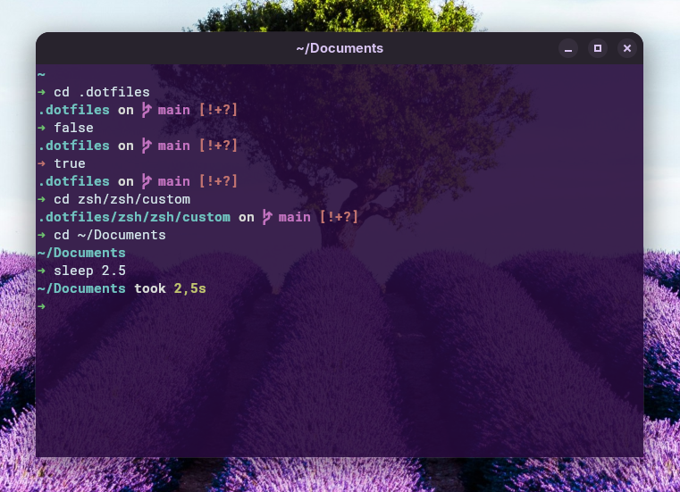

# Spaceshit ZSH Theme

> The beauty of [Spaceship](https://spaceship-prompt.sh/) with the speed of a minimalist setup.

**Spaceshit** is a lightweight, high-performance Oh My Zsh theme designed for developers who love the Spaceship aesthetic but want to keep their terminal snappy. By focusing on essential data like Git status and command execution time, it eliminates the "bloat" of checking for dozens of unused runtimes on every prompt render.



## Features

- **Compact path display**: Rooted at the current Git repository for better context.
- **Git status**: Shows branch and status (added, modified, ahead, etc.) using Oh My Zsh's built-in git helpers.
- **Command duration**: Displays how long the last command took to execute.
- **Visual feedback**: Color-coded success/error symbols.
- **Fast**: Minimal overhead by focusing only on essential segments.

## Requirements

- [Oh My Zsh](https://ohmyz.sh/)
- A [Powerline-compatible font](https://github.com/powerline/fonts) (required for the branch and prompt symbols).

## Installation

### Using Git (Recommended)

Clone the repository into your custom Oh My Zsh themes directory:

```bash
git clone https://github.com/claudiosanches/spaceshit-zsh-theme.git $ZSH_CUSTOM/themes/spaceshit-zsh-theme
```

Then, create a symbolic link (or copy) to make the theme discoverable by Oh My Zsh:

```bash
ln -s $ZSH_CUSTOM/themes/spaceshit-zsh-theme/spaceshit.zsh-theme $ZSH_CUSTOM/themes/spaceshit.zsh-theme
```

### Manual Installation

You can download the raw theme file directly using `curl`:

```bash
mkdir -p $ZSH_CUSTOM/themes
curl -L https://raw.githubusercontent.com/claudiosanches/spaceshit-zsh-theme/main/spaceshit.zsh-theme -o $ZSH_CUSTOM/themes/spaceshit.zsh-theme
```

### Activation

1. Set `ZSH_THEME="spaceshit"` in your `.zshrc`.
2. Restart your terminal or run `source ~/.zshrc`.

## Configuration

You can customize the theme by setting the following variables in your `.zshrc` _before_ sourcing Oh My Zsh:

| Variable                         | Default   | Description                                                     |
| -------------------------------- | --------- | --------------------------------------------------------------- |
| `SPACESHIT_GIT_SYMBOL_UNTRACKED` | `?`       | Symbol for untracked files.                                     |
| `SPACESHIT_GIT_SYMBOL_ADDED`     | `+`       | Symbol for added/staged files.                                  |
| `SPACESHIT_GIT_SYMBOL_MODIFIED`  | `!`       | Symbol for modified files.                                      |
| `SPACESHIT_GIT_SYMBOL_RENAMED`   | `»`       | Symbol for renamed files.                                       |
| `SPACESHIT_GIT_SYMBOL_DELETED`   | `x`       | Symbol for deleted files.                                       |
| `SPACESHIT_GIT_SYMBOL_UNMERGED`  | `=`       | Symbol for unmerged changes.                                    |
| `SPACESHIT_GIT_SYMBOL_AHEAD`     | `⇡`       | Symbol for when branch is ahead of remote.                      |
| `SPACESHIT_GIT_SYMBOL_BEHIND`    | `⇣`       | Symbol for when branch is behind remote.                        |
| `SPACESHIT_GIT_SYMBOL_DIVERGED`  | `⇕`       | Symbol for when branch has diverged from remote.                |
| `SPACESHIT_GIT_SYMBOL_STASHED`   | `$`       | Symbol for stashed changes.                                     |
| `SPACESHIT_PATH_COLOR`           | `cyan`    | Color for the path segment.                                     |
| `SPACESHIT_TEXT_COLOR`           | `white`   | Color for separator text like "on" and "took".                  |
| `SPACESHIT_GIT_BRANCH_COLOR`     | `magenta` | Color for the Git branch name.                                  |
| `SPACESHIT_GIT_STATUS_COLOR`     | `red`     | Color for the Git status symbols.                               |
| `SPACESHIT_TIMER_COLOR`          | `yellow`  | Color for the command duration timer.                           |
| `SPACESHIT_TIMER_THRESHOLD`      | `0`       | Minimum duration (in seconds) to show the timer.                |
| `SPACESHIT_TIMER_PRECISION`      | `1`       | Number of decimal places for the timer.                         |
| `SPACESHIT_TIMER_FORMAT`         | `%d`      | Format string for the timer (`%d` is replaced by the duration). |

## License

[MIT](LICENSE)
